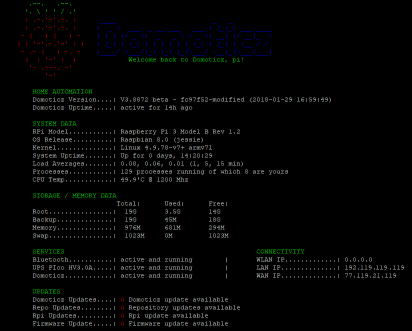

# MyDomoticz-Welcome:
Here you'll find my Domoticz scripts which keeps my household up and running. 
I am not a coder so those script could be not the cleanest solution but as long as they work i'm happy. 
Please be aware this aint a clone or anything near dzVents. 
I mention this as some compare my scripts to dzVents which is impossible. 
My scripts are just a bunch of standalone Lua scripts which run on a home brewed Lua function library.  
I share my scripts over here so that it can be a inspiration or guide for you all. 
This repository is reflecting my folder structure. 
 

# MyDomoticz-Different approach:
At first i want to mention you i don't run time based scripts. 
All my timers are done by my z-wave lux sensors which all report their lux at different time intervals. 
On which i run my time based scripts as their device status has/is changed. 
 
You'll notice i don't use the conventional Domoticz Lua scripting way. 
Meaning that normally all your event and timer scripts are situated in one folder (/lua) under Domoticz. 
I took a different path which started late 2015 in the Pi2 days. 
I never tried anything else or other way as this works for me. 
Maybe there are better or cleaner ways but this scripting style suites me. 
 
Normally you have all your Lua scripts in /home/pi/domoticz/scripts/lua/ 
All those scripts contained a commandArray = {} & return commandArray. 
Which can take a lot of CPU usage and resources and script reaction time is enormous if you have a lot of scripts. 
So back in time when there was no dzVents i looked for a solution to decrease my Pi2 load and a way to make scripts simpler when a value like devicename has changed. 
So i came up with the idea of running on main script which calls a event if all specified values where correct. 
 

# MyDomoticz-Scripts: 
You'll notice i just run 1 main device script called "script_device_main.lua". 
This script will look for any device status change. 
When a certain device mentioned in my trigger.lua library then it will react and start a event script. 
Meanwhile it calls several function libraries which i use lua globally. 
When a device isn't mentioned in the library then nothing happens which saves script loading/reading over and over again. 
In case of a event script is started the script will also watch if a 433Mhz device has to be switched. 
If it does detect one then it will send according my preset settings a redundant commandArray (ON/OFF) command to reduce 433mhz misfires. 
When done executing a event the script will according my Eventlog Dummy Selector Switch print a log or write to a log file.   
 
Further more you'll notice that i have several Lua libraries. 
functions.lua : Main Lua functions library. 
helper.lua    : Not in use right now but should contain functions and tables to spot Lua errors in the future. 
settings.lua  : Main settings library.  
switches.lua  : All my devices which i use in event scripts, it doesn't contain a device which i don't use. 
triggers.lua  : Table script with devices which may/can trigger a event, any device not listed can't trigger the event system. 
  
In my event scripts you won't find any device by their real name. 
All devices i use in my scripts are named in switches.lua library. 
Which saves me a lot of trouble when a device name has to be changed and there for not have to check every lua event. 
But just one name change in a switches.lua will affect all scripts. 
For a outsider of my Lua system it can be hard to read my scripts. 
But when you know the calling method and file load sequence it will be come clear. 
 
Anyway, This way it will save a lot of commandArray = {} & return commandArray and there for CPU and memory Usage. 
Back in my Pi2 days i had a CPU Usage of 80/90% but after converting to this method it decreased to 10% 
As for RAM resources, it decreased more then 80%. 
Although i am currently running Domoticz on a RPi3 i never stopped using this method. 
 

# MyDomoticz-Sidenote:
In general i won't provide any install guides and such. 
I assume you have some basic knowledge about Raspberry, Domoticz and Lua scripting. 
if not, then... #oops ;-) 
I just hope my scripts can be a inspiration or guide for you all. 
 

# MyDomoticz-GitHub Repository:
This repository contains my Lua, Bash, Python or any other scripts. 
Some of those are my own while other scripts i borrowed from other users. 
 

# MyDomoticz-Hardware:
- RPi3 - PIco UPS HV3.0A / Domo Beta 4.XXXX / RFXtrx433E / Aeotec Gen5 / NAS 
- RPi2 - PiHole / PiVPN / Print server 
- RPi3 - PIco UPS HV3.0A / SmartiPi case with 7" touchscreen wallmounted information screen 
# MyDomoticz-Devices:
- Youless Elec & Gas logging 
- FI9803P Cams 
- KD101 Smoke detectors 
- KaKu/CoCu door contacts, motion sensors, dimmers, switches and plugs 
- Z-Wave door contacts, motion sensors, dimmers, switches and plugs 
All my Rpi setups are running their /rootfs from a USB HDD 
 

# MyDomoticz-Screenshots:
MOTD login screen:  

