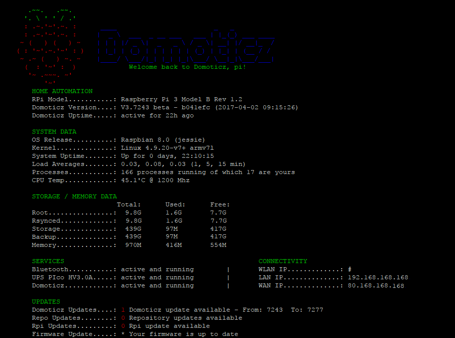
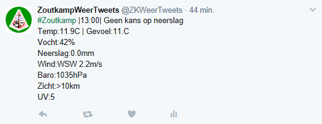

# MyDomoticz-Welcome:
Here you'll find my Domoticz scripts which keeps my household up and running. 
I am not a coder so those script could be not the cleanest sollution but as long as they work i'm happy. 
I share my scripts over here so that it can be a inspiration or guide for you all. 
 

# MyDomoticz-Hardware:
RPi3 - PIco hv3.0A Plus / Domoticz Beta Custom 3.8XXX / RFXtrx433E / Aeotec Gen5  
RPi3 - PIco hv3.0A Plus / PiHole / Youless Elec and Gas  
FI9803P Cams  
KD101 detectors  
KaKu/Z-Wave stuff 
Both my setups are running its /rootfs from a unpowered USB HDD 
 

# MyDomoticz-Scripts:
You'll notice that most of all my event scripts have a ON/OFF REPEAT - INTERVAL commandArray. 
As my current home automation system is mostly based on KaKu/CoCo 433Mhz modules. 
Which are a one way system serving the AC protocol and there for not giving any feedback to Domoticz if the device is really ON or OFF 
By using a REPEAT / INTERVAL commandArray i try to overrule the possibility of a missed signal.  
It aint ideal but for now it suites me. 
Slowly converting to Z-Wave until then i send double commands to 433Mhz devices. 
 
You will also notice i don't use the coventional Lua scripting way. 
Meaning that normally all your event and timer scripts are situated in one folder (/lua) under Domoticz. 
Which is then checked by Domoticz and triggered if needed. 
I took a different path which started back in the Pi2 days and where Domoticz just started developing. 
And i never tried any other way as this worked for me. 
Maybe there are better or cleaner ways but for this works fine. 
 
The base is simple, normally you have all your Lua scripts in /home/pi/domoticz/scripts/lua/ 
All those scripts contained a commandArray = {} & return commandArray. 
Which can take a lot of CPU usage and resources if you have a lot of scripts. 
Also when running a lot the reaction time decreases. 
 
The base is simple, effective and maybe not the cleanest way. 
I just run two scripts, "script_device_main.lua" and "script_time_main.lua" 
From those two files i call several hard coded lua files. 
Those event scripts are located outside Domoticz and don't contain commandArray = {} & return commandArray. 
As it controlled by the main device script. 
 
"script_device_main.lua" looks for devices who changed their status. 
If that device is defined in settings.lua then it may trigger a lua script. 
Meanwhile it calls a function libary, a file with functions which i use lua globally. 
 
"script_time_main.lua" looks for a string match. 
It looks for a string like script_time_name_10minutes.lua and if it finds a match then it may trigger that lua timer event. 
Meanwhile it calls a function libary, a file with functions which i use lua globally. 
 
This way it will saved a lot of commandArray = {} & return commandArray and there for CPU Usage. 
Back in my Pi2 days i had a CPU Usage of 80/90% but after converting to this method it decreased to 10% 
As for RAM resources, it decreased more then 80%. 
Although running i'm currently running Domoticz on a RPi3 i never stopped using this method. 
 

# MyDomoticz-Sidenote:
In general i won't provide any install guides and such. 
I assume you have some basic knowledge about Raspberry, Domoticz and scripting. 
if not, then... #oops ;-) 
 

# MyDomoticz-GitHub Repository:
This repository is reflecting my folder structure. 
Which contains my Lua, Bash, Python and other scripts. 
Some of those are my own and others found or borrowed from other users. 
My script repository can be in handy for you to do some inspiration or act as guide. 
 

# MyDomoticz-Screenshots:
MOTD login screen: 

 
Auto Weather Tweet: 

