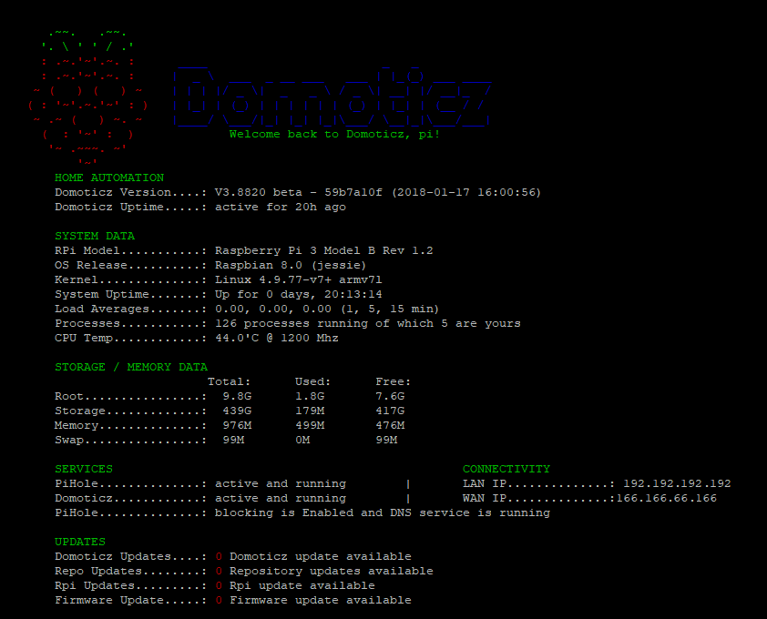
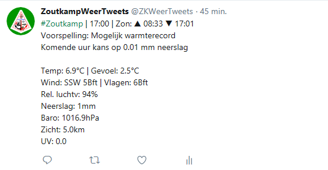

# MyDomoticz-Welcome:
Here you'll find my Domoticz scripts which keep my household up and running. 
I am not a coder so those script could be made cleaner but as long as they work I'll be happy with it. 
I share my scripts over here so that it can be a guide or maybe to get you new inspiration. 
 
# MyDomoticz-Hardware:
1x Raspi Pi 3 + RFXtrx433E for Domoticz  
1x Raspi Pi 3 for running Pi-Hole and do some logging data like gas and electricity as well as storing backups 
Both are stacked with a PIco hv3.0A Stack Plus 
 
3x Foscam FI9803P 
2x Youless Elec/Gas 
4x KD101 smoke detectors 
And a lot of KaKu/Coco devices 
 
Both my setups are running its /rootfs from a unpowered USB HDD 
 
# MyDomoticz-Scripts:
You'll notice that most of all my event scripts have a REPEAT / INTERVAL commandArray. 
As my current home automation system is based on KaKu/CoCo 433Mhz modules. 
Which are a one way system and there for not giving any feedback to Domoticz if the device is really ON or OFF 
By using a REPEAT / INTERVAL commandArray i try to overrule the possibility of a missed signal. 
It aint ideal but for now it suites me and works fine until i can/will switch to Zwave. 
 
You will also notice i don't use the coventional Lua scripting way. 
Meaning that normally all your event and timer scripts are situated in one folder (/lua) under Domoticz. 
Which is then checked by Domoticz and triggered if needed. 
I took a different path which started back in the Pi2 days and where Domoticz just started developing. 
And i never tried any other way as this worked for me. 
Maybe there are better or cleaner ways but for this works fine. 
 
The base is simple, 
Normally you have all your Lua scripts in /home/pi/domoticz/scripts/lua/ 
All those scripts contained a commandArray = {} & return commandArray. 
Which can take a lot of CPU usage and resources if you have a lot of scripts. 
Also when running a lot the reaction time decreases. 
 
The base i use is simple, effective and maybe not the cleanest. 
I just run two scripts, script_device_main.lua and "script_time_main.lua" 
From those two files i call several hard coded lua files. 
I call a function libary, a file with devices who must/can trigger a event and a worker.lua to assign a trigger device to a specific lua event script. 
Those event scripts are located outside Domoticz and don't contain commandArray = {} & return commandArray. 
As it controlled by the main device script. 
 
The same counts for timer script with just one side note. 
As for where i need to assign specific triggers to the device scripts. 
I use a function to seek for timer scripts in my Domoticz setup and run if needed but without the need for a commandArray = {} & return commandArray  
 
This way it saved a lot of commandArray = {} & return commandArray and there for CPU Usage. 
Back in my Pi2 days i had a CPU Usage of 80/90% but after converting to this method it decreased to 10% 
And RAM resources decreased more then 80%. 
Although running Domoticz on a RPi3 i never stopped using this method. 
 
# MyDomoticz-Sidenote:
In general i won't provide any install guides and such. 
I assume you have some basic knowledge about Raspberry, Domoticz and scripting. 
Most Lua scripts contain a header or at every event i explains what is going on,  
if not, then... #oops ;-) 
 
# MyDomoticz-GitHub Repository:
This repository is reflecting my folder structure. 
Which contains my Lua, Bash, Python and other scripts. 
Some of those are my own and others found or used from other users. 
My script repository can be in handy for you to do some inspiration or guide. 
 
# MyDomoticz-Screenshots:

MOTD login screen: 

 
Auto Weather Tweet: 

